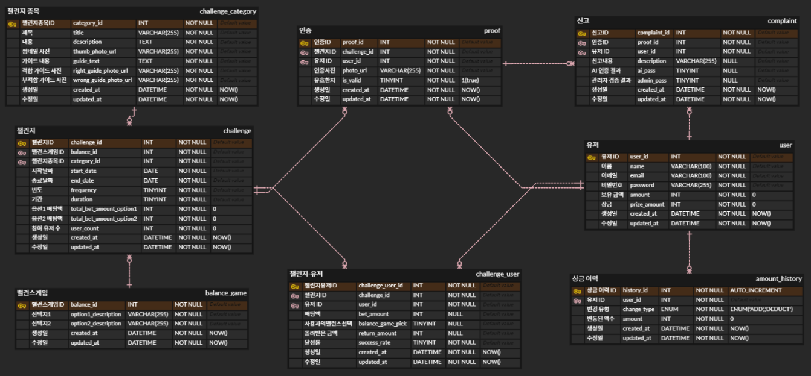

# Eco Farming


### "챌린지를 통해 환경 보호 습관 형성을 돕는 서비스"

## 🗓️ 프로젝트 개요

**팀명**: 하츄핑  
**기간**: 2024.08.19 - 2024.10.11 (8주)

## 👤 팀 구성

| 팀원 이름 | 역할 및 담당 | 주요 작업 |
|-----------|-------------|-----------|
| **김수빈** | BE, FE | 인증샷 업로드, 관리자 FCM & MM 알림 처리 |
| **김재현** | BE, FE | Spring Batch를 통한 챌린지 정산, 회원 관리, ERD 설계 |
| **김태경** | AI | ResNet-50 AI 모델 학습, Flask 배포 |
| **이찬민** | BE, FE, Infra | CI/CD 파이프라인 구축, 인증목록 조회 |
| **이지은** | Design, FE | 전체 페이지 디자인, 챌린지 상세페이지 구현 |
| **이효림** | BE, FE | 결제 프로세스 연동 및 UCC 제작 |

## 💡 기획 배경

환경 보호 실천을 지속하기 어려운 현실을 개선하기 위해 재미 요소와 보상 시스템, 커뮤니티 기반 챌린지를 도입하여 지속 가능한 환경 보호 문화를 조성하고자 함

### 🔎 문제 인식
- 지구 온도는 역사적 최고치를 연이어 경신하며 기후 위기가 심화되고 있음
- 많은 사람들이 환경 보호의 중요성을 인식하면서도 장기적인 실천에 어려움을 겪고 있음
- 개인의 의지만으로는 지속적인 환경 보호 활동을 유지하기 어려운 현실적 한계 존재

### 📊 원인 분석
- 환경 보호 활동은 개인 단독으로 실천 시 동기부여와 흥미 요소가 부족함
- 성취감과 보상을 즉각적으로 경험하기 어려워 지속적 참여율 저하
- 함께 참여하고 공유할 수 있는 통합 플랫폼의 부재로 사회적 연대감 형성에 한계

### 🎯 해결 방안
- 사용자 동기부여 메커니즘 구축: 상금, 포인트 제도, 레벨 시스템을 통한 보상 체계 확립
- 소셜 임팩트 강화: 챌린지 참여, 인증샷 공유를 통한 사회적 연대감 조성
- 게이미피케이션 요소 도입: 환경 보호 활동을 게임화된 챌린지 형식으로 재구성하여 재미와 성취감 부여

## 🛠 기술 스택

### 🖥️ Frontend

<div style="background-color: #f8f9fa; padding: 15px; border-radius: 5px;">


</div>

### 🧠 Backend

<div style="background-color: #f8f9fa; padding: 15px; border-radius: 5px;">


</div>

### 🤖 AI

<div style="background-color: #f8f9fa; padding: 15px; border-radius: 5px;">

</div>

### 🌐 Infrastructure

<div style="background-color: #f8f9fa; padding: 15px; border-radius: 5px;">


</div>

## 🔑 주요 기능
<table>
  <tr>
    <td></td>
    <td></td>
    <td></td>
  </tr>
</table>

## 🌟 차별성
<table>
  <tr>
    <td></td>
    <td></td>
    <td></td>
  </tr>
</table>


## 🏗️ 시스템 아키텍처


## 📑 ERD




## 📂 프로젝트 구조

### 🗂️ 백엔드 프로젝트 구조
```
├── 🗂️ backend
│   ├── 🗂️ gradle
│   └── 🗂️ src
│       ├── 🗂️ main
│       │   ├── 🗂️ java
│       │   │   └── 🗂️ com.a101.ecofarming
│       │   │               ├── 🗂️ balanceGame
│       │   │               │   ├── 🗂️ entity
│       │   │               │   └── 🗂️ repository
│       │   │               ├── 🗂️ challenge
│       │   │               │   ├── 🗂️ batch
│       │   │               │   │   ├── 🗂️ config
│       │   │               │   │   ├── 🗂️ scheduler
│       │   │               │   │   └── 🗂️ tasklet
│       │   │               │   ├── 🗂️ controller
│       │   │               │   ├── 🗂️ dto
│       │   │               │   │   └── 🗂️ response
│       │   │               │   ├── 🗂️ entity
│       │   │               │   ├── 🗂️ repository
│       │   │               │   └── 🗂️ service
│       │   │               ├── 🗂️ challengeCategory
│       │   │               │   ├── 🗂️ entity
│       │   │               │   ├── 🗂️ repository
│       │   │               │   └── 🗂️ service
│       │   │               ├── 🗂️ challengeUser
│       │   │               │   ├── 🗂️ batch
│       │   │               │   │   ├── 🗂️ config
│       │   │               │   │   ├── 🗂️ processor
│       │   │               │   │   ├── 🗂️ reader
│       │   │               │   │   ├── 🗂️ scheduler
│       │   │               │   │   └── 🗂️ writer
│       │   │               │   ├── 🗂️ controller
│       │   │               │   ├── 🗂️ dao
│       │   │               │   ├── 🗂️ dto
│       │   │               │   │   └── 🗂️ response
│       │   │               │   ├── 🗂️ entity
│       │   │               │   ├── 🗂️ repository
│       │   │               │   └── 🗂️ service
│       │   │               ├── 🗂️ complaint
│       │   │               │   ├── 🗂️ controller
│       │   │               │   ├── 🗂️ dto
│       │   │               │   ├── 🗂️ entity
│       │   │               │   ├── 🗂️ repository
│       │   │               │   └── 🗂️ service
│       │   │               ├── 🗂️ global
│       │   │               │   ├── 🗂️ config
│       │   │               │   ├── 🗂️ entity
│       │   │               │   ├── 🗂️ exception
│       │   │               │   ├── 🗂️ notification
│       │   │               │   │   └── 🗂️ mattermost
│       │   │               │   │   └── 🗂️ fcm
│       │   │               │   └── 🗂️ security
│       │   │               │       ├── 🗂️ Controller
│       │   │               │       ├── 🗂️ config
│       │   │               │       ├── 🗂️ dto
│       │   │               │       ├── 🗂️ filter
│       │   │               │       ├── 🗂️ repository
│       │   │               │       ├── 🗂️ service
│       │   │               │       └── 🗂️ util
│       │   │               ├── 🗂️ proof
│       │   │               │   ├── 🗂️ controller
│       │   │               │   ├── 🗂️ dto
│       │   │               │   │   ├── 🗂️ request
│       │   │               │   │   └── 🗂️ response
│       │   │               │   ├── 🗂️ entity
│       │   │               │   ├── 🗂️ repository
│       │   │               │   └── 🗂️ service
│       │   │               └── 🗂️ user
│       │   │                   ├── 🗂️ controller
│       │   │                   ├── 🗂️ dto
│       │   │                   │   ├── 🗂️ request
│       │   │                   │   └── 🗂️ response
│       │   │                   ├── 🗂️ entity
│       │   │                   ├── 🗂️ repository
│       │   │                   └── 🗂️ service
│       │   └── 🗂️ resources
```

### 🗂️ 프론트엔드 프로젝트 구조 
```
├── 🗂️ frontend
│   ├── 🗂️ public
│   │   └── 🗂️ icons
│   └── 🗂️ src
│       ├── 🗂️ assets
│       │   └── 🗂️ images
│       ├── 🗂️ components
│       └── 🗂️ services
```

---
## 📹 시연 영상 및 자료

- **발표 자료:** [MiriCanvas](https://www.miricanvas.com/v/13qpik5)
- **시연 영상:** [YouTube](https://www.youtube.com/watch?v=ngiXBbhoRrc)
- **영상 포트폴리오** [YouTube](https://www.youtube.com/watch?v=_zmqM5AO4hQ)   
- **배포 링크:** https://ecofarming.lol (현재 서비스 종료)
