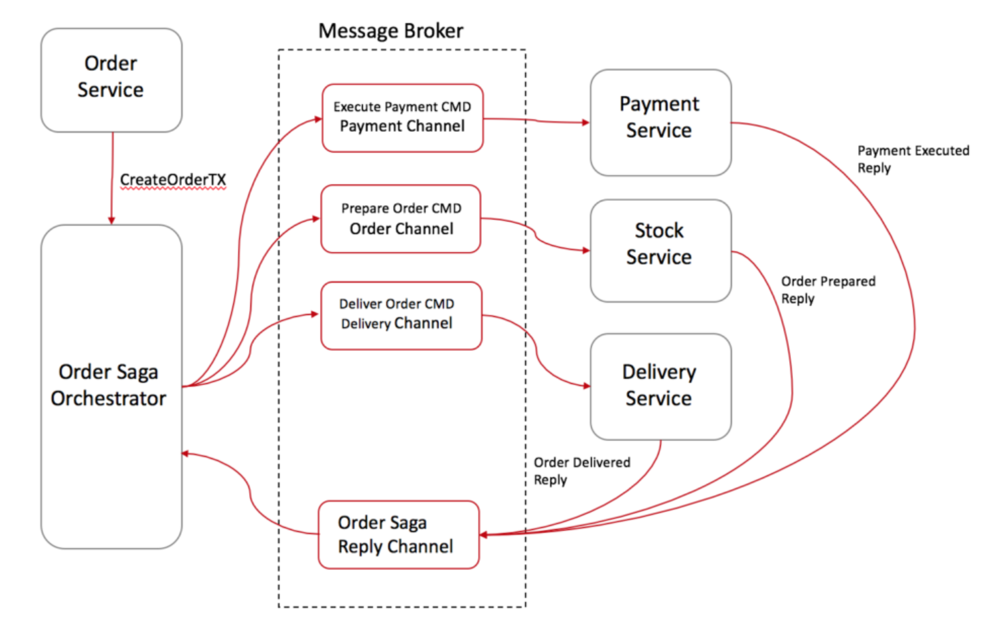

# MSA 구조 데이터 일관성 문제 

- MSA 구조에서는 서비스간 API로 통신하기 때문에 데이터 일관성을 해칠 수 있다.
그럼 어떻게 해야하지?

### SAGA패턴

- SAGA 패턴은 MSA환경에서 일관성을 지키기 여렵다는 것을 기반으로, 약간의 일관성을 포기하고 Eventual Consistency(최종 일관성)을 보장하여 효율성을 높이기 위한 패턴
    - SAGA 패턴은 긴 트랜잭션을 여러 개의 짧은 로컬 트랜잭션으로 분리하는 접근 방식
    - 각 트랜잭션은 다른 트랜잭션의 완료를 기다리지 않고 독립적으로 실행됨
    - 따라서 트랜잭션의 원자성을 지켜줄 방법이 필요!
    - 중간에 문제가 발생하면, 보상(Compenstation) 트랜잭션이 실행되어 이전 트랜잭션을 롤백하는 것과 같은 효과를 가져옴

- 각 로컬 트랜잭션은 자신의 트랜잭션을 끝내고 다음 트랜잭션을 호출하는 메시지, 이벤트를 생성

- 보상 트랜잭션이란?
    - 보상 트랜잭션은 분산된 트랜잭션 중 일부가 실패할 경우, 그 실패 전에 성공적으로 완료된 트랜잭션을 보상 즉, 되돌리는 역할을 하는 트랜잭션
    - SAGA 패턴의 트랜잭션은 분산된 여러 독립적인 트랜잭션이기 떄문에, 어떤 서비스의 트랜잭션이 실패하면 단일 트랜잭션 처럼 롤백 메커니즘을 사용할 수 없다. 대신 보상 트랜잭션을 사용하여 이전에 성공한 트랜잭션의 효과를 취소한다.

- 구현방법
    - Choreography SAGA
        - Choreography 방식은 각 서비스끼리 이벤트를 주고 받는 방식.
        - 각 서비스가 다른 서비스의 로컬 트랜잭션을 이벤트 트리거하는 방식으로 이루어짐
        - 이 방식은 중앙집중된 지점이 없이 모든 서비스가 메시지 브로커(RabbitMQ, Kafka)를 통해 이벤트를 Pub/Sub 하는 구조

        

    - Orchestration SAGA
        - 오케스트레이션 사가는 중앙 집중형으로 실행 흐름을 관리함
        - Ochestrator는 요청을 실행, 각 서비스의 상태를 확인하고, 실패에 대한 보상 트랜잭션을 실행
        - Ochestration은 트랜잭션 처리를 위한 Manager 인스턴스가 별도로 존재
        - Ochestrator가 중앙 집중형 컨트롤러 역할 → 각 서비스에서 실행할 트랜잭션을 관리를 하게됩니다.
    
        

    - 코레오그래피는 서비스 간 결합도가 낮고 유연성이 높지만, 시스템 전체의 흐름을 파악하고 관리하기 어렵다.
    - 오케스트레이션은 중앙 집중식 제어로 명확한 흐름과 관리가 가능하지만, 시스템이 중앙 조정자에 의존하게 되고 결합도가 높아진다.

    => 굉장히 어렵다.. 좀 더 공부해봐야할것 같다

### SAGA 패턴의 장단점
- 장점: 서비스 간의 느슨한 결합을 유지하면서도 데이터 일관성을 유지할 수 있습니다.
- 단점: 설계와 구현이 복잡해질 수 있으며, 롤백이 아닌 보상 트랜잭션을 사용하므로 일부 작업이 완전히 취소되지 않을 수 있습니다.
