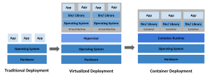

# **쿠버네티스란 무엇인가?**

**전통적인 배포 시대:** 초기 조직은 애플리케이션을 물리 서버에서 실행했었다. 

**가상화된 배포 시대:** 그 해결책으로 가상화가 도입되었다. 이는 단일 물리 서버의 CPU에서 여러 가상 시스템 (VM)을 실행할 수 있게 한다.

**컨테이너 개발 시대:** 컨테이너는 VM과 유사하지만 격리 속성을 완화하여 애플리케이션 간에 운영체제(OS)를 공유한다. 그러므로 컨테이너는 가볍다고 여겨진다. VM과 마찬가지로 컨테이너에는 자체 파일 시스템, CPU 점유율, 메모리, 프로세스 공간 등이 있다. 기본 인프라와의 종속성을 끊었기 때문에, 클라우드나 OS 배포본에 모두 이식할 수 있다.

컨테이너는 다음과 같은 추가적인 혜택을 제공하기 때문에 유명해졌다.

- 기민한 애플리케이션 생성과 배포: VM 이미지를 사용하는 것에 비해 컨테이너 이미지 생성이 보다 쉽고 효율적이다.
- 지속적인 개발, 통합 및 배포: 안정적이고 주기적으로 컨테이너 이미지를 빌드해서 배포할 수 있고 (이미지의 불변성 덕에) 빠르고 효율적으로 롤백할 수 있다.
- 개발과 운영의 관심사 분리: 배포 시점이 아닌 빌드/릴리스 시점에 애플리케이션 컨테이너 이미지를 만들기 때문에, 애플리케이션이 인프라스트럭처에서 분리된다.
- 가시성(observability): OS 수준의 정보와 메트릭에 머무르지 않고, 애플리케이션의 헬스와 그 밖의 시그널을 볼 수 있다.
- 개발, 테스팅 및 운영 환경에 걸친 일관성: 랩탑에서도 클라우드에서와 동일하게 구동된다.
- 클라우드 및 OS 배포판 간 이식성: Ubuntu, RHEL, CoreOS, 온-프레미스, 주요 퍼블릭 클라우드와 어디에서든 구동된다.
- 애플리케이션 중심 관리: 가상 하드웨어 상에서 OS를 실행하는 수준에서 논리적인 리소스를 사용하는 OS 상에서 애플리케이션을 실행하는 수준으로 추상화 수준이 높아진다.
- 느슨하게 커플되고, 분산되고, 유연하며, 자유로운 마이크로서비스: 애플리케이션은 단일 목적의 머신에서 모놀리식 스택으로 구동되지 않고 보다 작고 독립적인 단위로 쪼개져서 동적으로 배포되고 관리될 수 있다.
    - 리소스 격리: 애플리케이션 성능을 예측할 수 있다.
    - 리소스 사용량: 고효율 고집적.

## **쿠버네티스가 왜 필요하고 무엇을 할 수 있나**

컨테이너는 애플리케이션을 포장하고 실행하는 좋은 방법이다. 프로덕션 환경에서는 애플리케이션을 실행하는 컨테이너를 관리하고 가동 중지 시간이 없는지 확인해야 한다. 예를 들어 컨테이너가 다운되면 다른 컨테이너를 다시 시작해야 한다. 이 문제를 시스템에 의해 처리한다면 더 쉽지 않을까?

그것이 쿠버네티스가 필요한 이유이다! 쿠버네티스는 분산 시스템을 탄력적으로 실행하기 위한 프레임 워크를 제공한다. 애플리케이션의 확장과 장애 조치를 처리하고, 배포 패턴 등을 제공한다. 예를 들어, 쿠버네티스는 시스템의 카나리아 배포를 쉽게 관리할 수 있다.

쿠버네티스는 다음을 제공한다.

- **서비스 디스커버리와 로드 밸런싱** 쿠버네티스는 DNS 이름을 사용하거나 자체 IP 주소를 사용하여 컨테이너를 노출할 수 있다. 컨테이너에 대한 트래픽이 많으면, 쿠버네티스는 네트워크 트래픽을 로드밸런싱하고 배포하여 배포가 안정적으로 이루어질 수 있다.
- **스토리지 오케스트레이션** 쿠버네티스를 사용하면 로컬 저장소, 공용 클라우드 공급자 등과 같이 원하는 저장소 시스템을 자동으로 탑재할 수 있다
- **자동화된 롤아웃과 롤백** 쿠버네티스를 사용하여 배포된 컨테이너의 원하는 상태를 서술할 수 있으며 현재 상태를 원하는 상태로 설정한 속도에 따라 변경할 수 있다. 예를 들어 쿠버네티스를 자동화해서 배포용 새 컨테이너를 만들고, 기존 컨테이너를 제거하고, 모든 리소스를 새 컨테이너에 적용할 수 있다.
- **자동화된 빈 패킹(bin packing)** 컨테이너화된 작업을 실행하는데 사용할 수 있는 쿠버네티스 클러스터 노드를 제공한다. 각 컨테이너가 필요로 하는 CPU와 메모리(RAM)를 쿠버네티스에게 지시한다. 쿠버네티스는 컨테이너를 노드에 맞추어서 리소스를 가장 잘 사용할 수 있도록 해준다.
- **자동화된 복구(self-healing)** 쿠버네티스는 실패한 컨테이너를 다시 시작하고, 컨테이너를 교체하며, '사용자 정의 상태 검사'에 응답하지 않는 컨테이너를 죽이고, 서비스 준비가 끝날 때까지 그러한 과정을 클라이언트에 보여주지 않는다.
- **시크릿과 구성 관리** 쿠버네티스를 사용하면 암호, OAuth 토큰 및 SSH 키와 같은 중요한 정보를 저장하고 관리할 수 있다. 컨테이너 이미지를 재구성하지 않고 스택 구성에 시크릿을 노출하지 않고도 시크릿 및 애플리케이션 구성을 배포 및 업데이트할 수 있다.

## **쿠버네티스가 아닌 것**

쿠버네티스는 전통적인, 모든 것이 포함된 Platform as a Service(PaaS)가 아니다. 쿠버네티스는 하드웨어 수준보다는 컨테이너 수준에서 운영되기 때문에, PaaS가 일반적으로 제공하는 배포, 스케일링, 로드 밸런싱과 같은 기능을 제공하며, 사용자가 로깅, 모니터링 및 알림 솔루션을 통합할 수 있다. 하지만, 쿠버네티스는 모놀리식(monolithic)이 아니어서, 이런 기본 솔루션이 선택적이며 추가나 제거가 용이하다. 쿠버네티스는 개발자 플랫폼을 만드는 구성 요소를 제공하지만, 필요한 경우 사용자의 선택권과 유연성을 지켜준다.

