# TOP(Time Optimization Platform)


### "웹사이트와 프로그램 집중 시간 측정 서비스"

## 🗓️ 프로젝트 개요

**팀명** : 티모  
**기간** : 2024.07.02 - 2024.08.16 (7주)

## 👤 팀 구성

| 팀원 이름 | 역할 및 담당 | 주요 작업 |
|-----------|-------------|-----------|
| **강태경** | INFRA, BE | CI/CD 파이프라인 구축, 화상회의 시스템 개발, 회원 관리 |
| **김재현** | BE, DB | 데이터베이스 모델링, 집중 시간 측정·분석 API 및 위젯 데이터 서비스 구현 |
| **김태경** | FE | 프론트엔드 전반 개발 및 관리 |
| **연상헌** | FE | 프론트엔드 전반 개발 및 관리, 화상회의 시스템 개발 |
| **이윤지** | BE | 금지 목록, 친구 기능, 위젯 배치 시스템 개발 |
| **정태완** | FE, INFRA | 프론트엔드 전반 개발 및 관리, 크롬 익스텐션 개발 |

## 💡 기획 의도

TOP은 사용자의 디지털 활동 시간을 객관적으로 측정하고 시각화하여 효율적인 시간 관리를 돕는 플랫폼입니다. 현대인의 디지털 기기 사용 증가에 따라, 자신의 시간 활용을 정확히 파악하기 어려운 문제를 해결합니다. 웹사이트와 프로그램 사용 시간을 자동 추적하고 직관적인 대시보드로 제공함으로써 시간 관리 습관 개선과 생산성 향상을 목표로 합니다.

## 🔑 주요 기능

- 크롬 익스텐션 기반 지원 : 간편한 설치로 웹사이트와 프로그램의 사용 시간을 자동 추적
- 사용 시간 추적 : 웹사이트와 프로그램별 상세 사용 시간 기록 및 분석
- 맞춤형 데이터 대시보드 : 다양한 분석 위젯을 자유롭게 배치하여 개인화된 사용 패턴 모니터링 제공
- 금지 목록 설정 : 사용자가 집중 시간으로 측정하지 않을 프로그램 목록 관리 기능
- 실시간 화면 공유 : 친구로 지정된 사용자의 화면을 볼 수 있어 상호 책임감 강화 및 집중도 향상

## 🛠 기술 스택

### 🖥️ Frontend

<div style="background-color: #f8f9fa; padding: 15px; border-radius: 5px;">


</div>

### 🧠 Backend

<div style="background-color: #f8f9fa; padding: 15px; border-radius: 5px;">


</div>

### 🌐 Infrastructure

<div style="background-color: #f8f9fa; padding: 15px; border-radius: 5px;">


</div>

## 🎨 구현 결과

### 크롬 익스텐션 지원
- Chrome 웹 스토어에 정식 출시

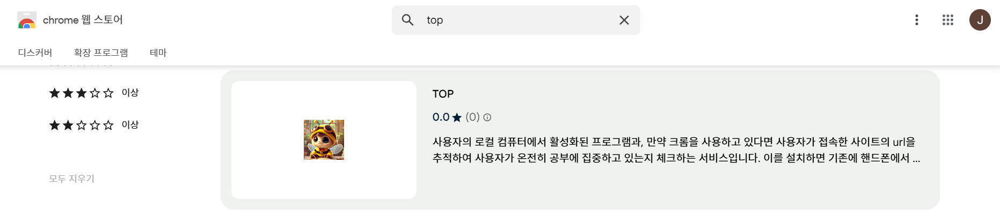

### 대시보드 인터페이스
- 직관적인 사용자 대시보드를 통해 집중 시간과 활동을 한눈에 파악 가능

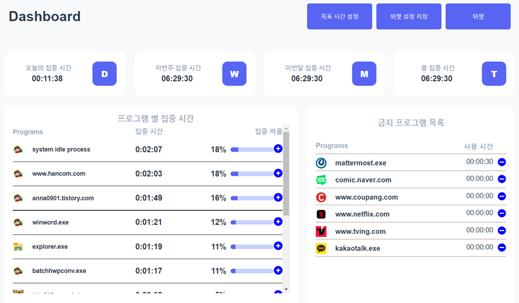

### 맞춤형 위젯 시스템
- 사용자가 필요한 위젯을 자유롭게 선택하고 배치 가능
- 레이아웃 커스터마이징 및 저장 기능 지원

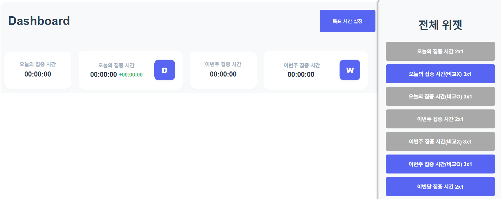

### 일일 목표 관리
- 개인별 집중 시간 목표를 설정하고 달성 현황 추적

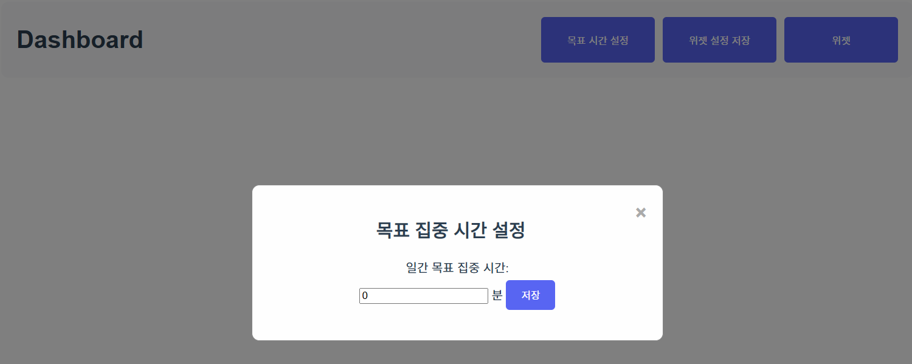

### 다양한 분석 위젯(데이터 연결 안 된 상태)
- 생산성 향상을 위한 다양한 데이터 시각화 위젯 제공

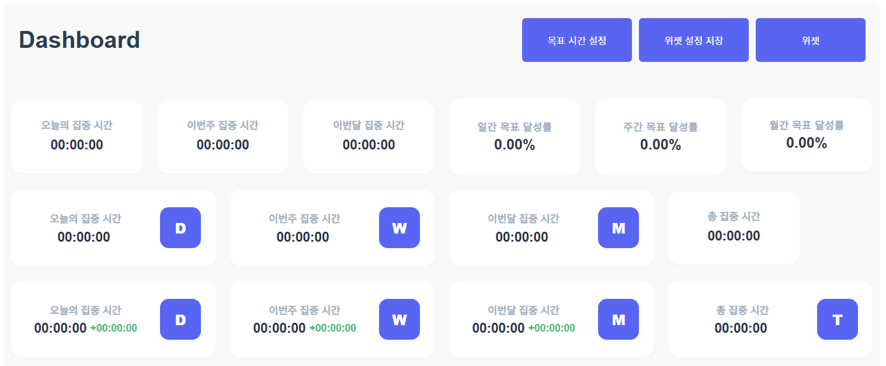
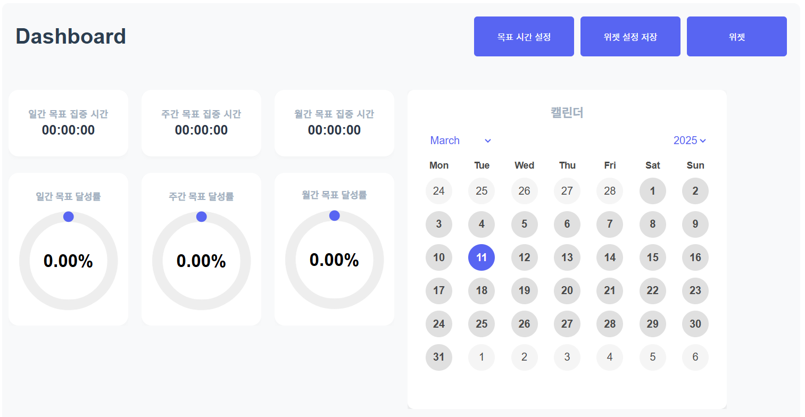
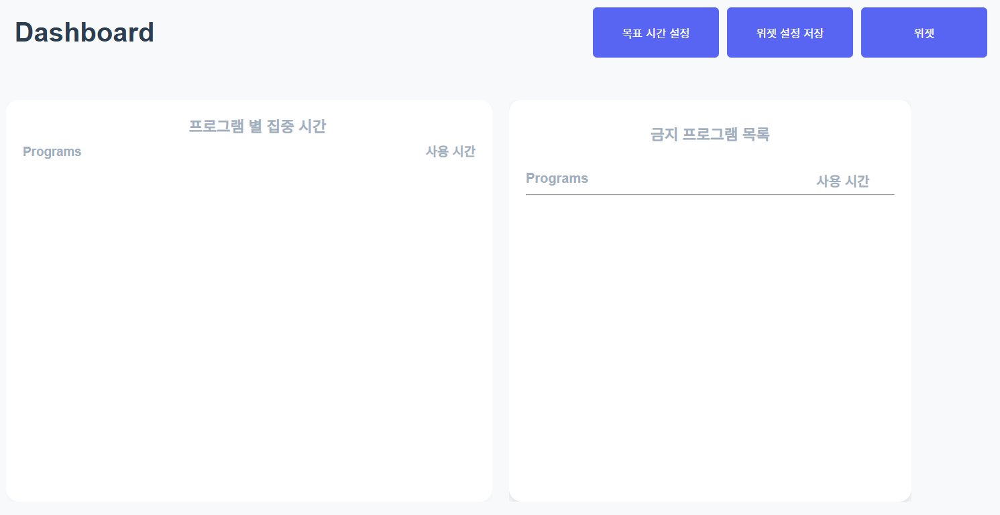
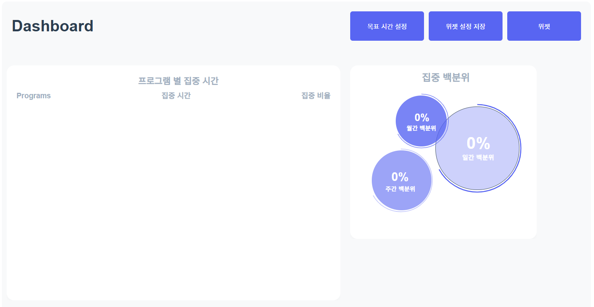
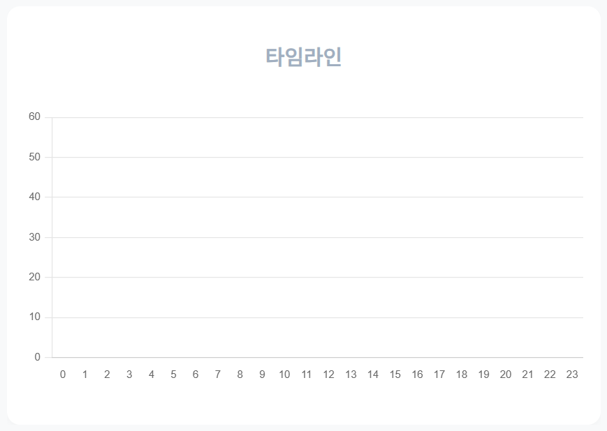
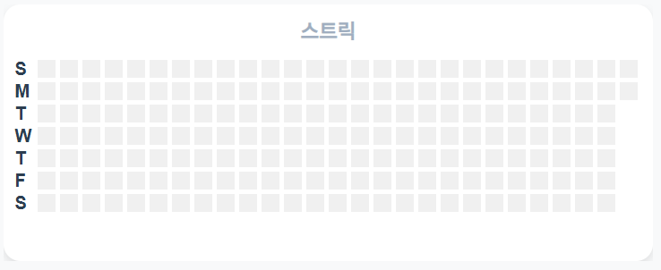

## 📑 ERD

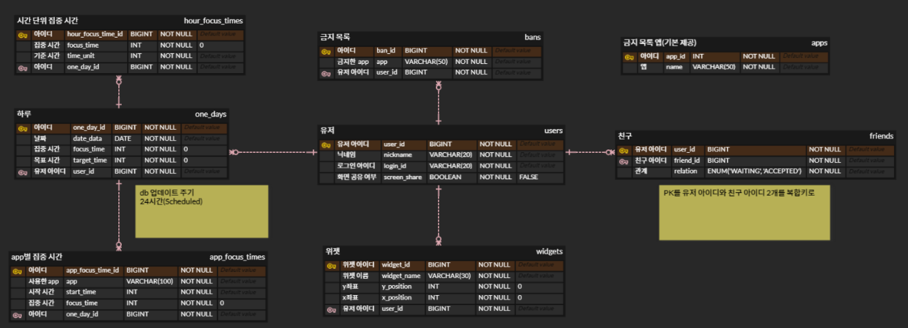

## 📂 프로젝트 구조

### 🗂️ 백엔드 프로젝트 구조
```
└─📁 src
    ├─📁 main
    │  ├─📁 java
    │  │  └─📁 com
    │  │      └─📁 ssafy
    │  │          └─📁 top
    │  │              │  📄 TopApplication.java
    │  │              │
    │  │              ├─📁 appfocustimes
    │  │              │  ├─📁 application
    │  │              │  ├─📁 dao
    │  │              │  ├─📁 domain
    │  │              │  ├─📁 dto
    │  │              │  │  ├─📁 request
    │  │              │  │  └─📁 response
    │  │              │  └─📁 presentation
    │  │              │
    │  │              ├─📁 apps
    │  │              │  └─📁 domain
    │  │              │
    │  │              ├─📁 bans
    │  │              │  ├─📁 application
    │  │              │  ├─📁 domain
    │  │              │  ├─📁 dto
    │  │              │  │  ├─📁 request
    │  │              │  │  └─📁 response
    │  │              │  └─📁 presentation
    │  │              │
    │  │              ├─📁 friends
    │  │              │  ├─📁 application
    │  │              │  ├─📁 domain
    │  │              │  ├─📁 dto
    │  │              │  │  └─📁 response
    │  │              │  └─📁 presentation
    │  │              │
    │  │              ├─📁 global
    │  │              │  ├─📁 auth
    │  │              │  │  ├─📁 application
    │  │              │  │  └─📁 domain
    │  │              │  ├─📁 config
    │  │              │  ├─📁 domain
    │  │              │  └─📁 exception
    │  │              │      └─📁 validation
    │  │              │
    │  │              ├─📁 onedays
    │  │              │  ├─📁 application
    │  │              │  ├─📁 domain
    │  │              │  ├─📁 dto
    │  │              │  │  ├─📁 request
    │  │              │  │  └─📁 response
    │  │              │  └─📁 presentation
    │  │              │
    │  │              ├─📁 users
    │  │              │  ├─📁 application
    │  │              │  ├─📁 domain
    │  │              │  ├─📁 dto
    │  │              │  │  ├─📁 request
    │  │              │  │  └─📁 response
    │  │              │  └─📁 presentation
    │  │              │
    │  │              └─📁 widgets
    │  │                  ├─📁 application
    │  │                  ├─📁 domain
    │  │                  ├─📁 dto
    │  │                  └─📁 presentation
    │  │
    │  └─📁 resources
    │      │  📄 application-dev.yml
    │      │  📄 application-local.yml
    │      │  📄 application-oauth.yml
    │      │  📄 application.yml
    │      │
    │      ├─📁 sql
    │      │      📄 data.sql
    │      │
    │      └─📁 static
    │              📄 index.html
    │
    └─📁 test
```

## 🔧 개선점
- AI 모션 인식 기술을 통한 정확한 집중 시간 측정
    - AI 모션 인식 기술이 사용자의 행동 패턴(자리 이탈, 스마트폰 사용 등)을 감지하여 실제 작업에 집중한 시간만 측정한다면, 사용자는 더욱 정확한 생산성 데이터를 확보하고 자신의 작업 패턴을 보다 객관적으로 분석 가능

- 친구 기능 강화 및 경쟁 시스템 도입
    - 친구 간 집중 시간 랭킹, 주간 목표 달성률 비교, 챌린지 시스템 등을 통해 건전한 경쟁 구도를 형성하여 지속적인 동기 부여와 사용자 참여도 증진 가능

## 🌿 브랜치
- develop branch : BackEnd 소스 코드
- front branch : FrontEnd 소스 코드
- chrome-extension branch : chrome-extension 소스 코드